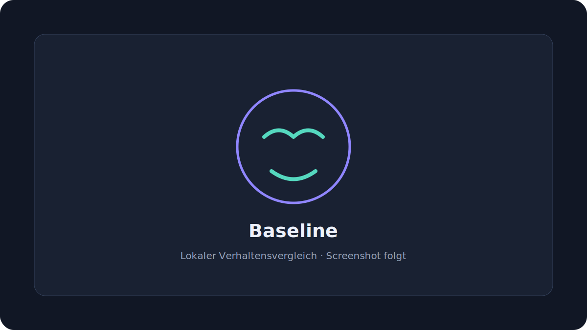

# Baseline – lokaler Verhaltensvergleich

Baseline ist eine browserbasierte Forschungs- und Demonstrationsanwendung. Sie vergleicht ausgewählte Gesichts- und Stimmmerkmale einer neuen Aufnahme mit mehreren persönlichen Vergleichsaufnahmen. Die App ist **kein Lügendetektor** und trifft keine Aussage darüber, ob eine Aussage wahr oder falsch ist.

> Eine Abweichung ist kein Beweis für eine Lüge. Stress, Unsicherheit, Konzentration, Müdigkeit, Lichtverhältnisse und viele weitere Faktoren können das Ergebnis beeinflussen.

## Screenshot



_Der Platzhalter wird in einer späteren Version durch einen aktuellen Produkt-Screenshot ersetzt._

## Funktionen

- geführte Kalibrierung mit sechs abwechslungsreichen Vergleichsaufnahmen
- MediaPipe Face Landmarker mit Blendshapes und Kopf-Transformationen
- Messung von Blinzeln, Augenöffnung, Augenbrauen-, Mund-, Kiefer- und Kopfbewegungen
- optionale lokale Web-Audio-Analyse für Lautstärke, Pausen, Antwortbeginn und grobe Tonhöhenschwankung
- robuste persönliche Baseline mit Median und Median Absolute Deviation (MAD)
- qualitätsgewichteter, begrenzter **Abweichungswert** – keine Wahrscheinlichkeit
- eigener Qualitätswert für Sichtbarkeit, Licht, Bildrate, Position, Dauer und optional Audio
- Verzicht auf präzise Ergebniswerte bei unzureichender Aufnahmequalität
- lokale Verlaufsliste und SVG-Diagramme
- heller und dunkler Modus, responsive Navigation und mobile Aufnahmeoberfläche
- lokales Löschen aller Kalibrierungs- und Analysedaten
- keine Werbung, kein Tracking, keine externe KI-API und kein Backend
- vorgeschalteter einfacher Zugangscode für den privaten Testbetrieb

## Technologien

- React 19 und TypeScript
- Vite
- MediaPipe Tasks Vision
- Web Audio API und `getUserMedia`
- `localStorage` für ausschliesslich lokale zusammengefasste Messwerte
- Web Worker für die vorbereitete entkoppelte Auswertungslogik
- Vitest und Playwright
- GitHub Actions und GitHub Pages

## Lokale Installation

Voraussetzungen: Node.js 22 oder neuer und npm.

```bash
git clone https://github.com/brqfwvb5sr-afk/Gesichtsmimik.git
cd Gesichtsmimik
npm install
npm run dev
```

Kamera und Mikrofon benötigen einen sicheren Kontext. `localhost` funktioniert in modernen Browsern auch während der lokalen Entwicklung. Für andere Geräte im Netzwerk ist HTTPS erforderlich.

## Entwicklungsbefehle

```bash
npm run lint       # statische Prüfung
npm run test       # Unit-Tests
npm run build      # TypeScript- und Produktions-Build
npm run test:e2e   # Desktop- und Mobile-Smoke-Test
npm run preview    # fertigen Build lokal anzeigen
```

## Deployment

Der Workflow [`.github/workflows/deploy-pages.yml`](.github/workflows/deploy-pages.yml) wird bei jedem Push auf `main` ausgeführt. Er installiert reproduzierbar mit `npm ci`, führt Lint, Unit-Tests, Produktions-Build und Playwright-Smoke-Tests aus und veröffentlicht danach `dist` über GitHub Pages.

Vite verwendet den Basis-Pfad `/Gesichtsmimik/`. Die App nutzt `HashRouter`, damit Navigation und Neuladen auf GitHub Pages keine 404-Fehler erzeugen.

## Datenschutz

- Kamera- und Mikrofondaten werden nur als laufender Browser-Stream verarbeitet.
- Es werden keine Video- oder Audiodateien erstellt oder hochgeladen.
- Gespeichert werden nur zusammengefasste Kalibrierungs- und Ergebniswerte im lokalen Browser-Speicher.
- Das GitHub-Repository enthält keine personenbezogenen Analysedaten.
- Die MediaPipe-WASM-Laufzeit wird mit der Website ausgeliefert. Nur das statische Gesichtsmodell wird beim ersten Start aus dem offiziellen öffentlichen Modell-Speicher geladen; die eigentlichen Medienströme werden nicht dorthin übertragen.
- Andere Personen dürfen nur mit ausdrücklicher, informierter Einwilligung analysiert werden.

## Zugangsschutz

Vor der Anwendung erscheint eine clientseitige Codeabfrage. Die Freigabe wird nur in `sessionStorage` gespeichert und endet mit der Browser-Sitzung. Weil GitHub Pages ausschliesslich statische Dateien ausliefert, ist dieser Schutz nur eine Hürde für den privaten Testbetrieb und keine sichere Authentifizierung: Der Code ist grundsätzlich im ausgelieferten JavaScript auffindbar.

## Berechnung

Für jedes ausreichend oft gemessene Merkmal wird der Median als persönlicher Mittelpunkt bestimmt. Die typische Streuung wird aus der skalierten Median Absolute Deviation abgeleitet. Eine neue Aufnahme wird mittels begrenzter robuster Abstände mit diesem Bereich verglichen. Fehlende Werte werden ausgelassen, extreme Ausreisser begrenzt und schlechte Aufnahmequalität reduziert die Verlässlichkeit. Unterhalb der Qualitätsschwelle wird überhaupt kein präziser Prozentwert angezeigt.

Der Wert ist ein **Abweichungswert** und keine Lügen-, Wahrheits- oder Täuschungswahrscheinlichkeit.

## Wissenschaftliche Grenzen

- Verhalten ist kontextabhängig und nicht eindeutig mit Wahrheit oder Täuschung verknüpft.
- Eine normale Webcam erfasst schnelle Gesichtsvorgänge oft nicht mit ausreichender Bildrate. Die App nennt solche Vorgänge deshalb nicht automatisch „Mikroexpressionen“.
- MediaPipe-Blendshapes sind Schätzwerte und können durch Gesichtswinkel, Verdeckung, Brille, Hautbeleuchtung und Kameraqualität beeinflusst werden.
- Die einfache Tonhöhenschätzung ist bei Hintergrundgeräusch, Flüstern und manchen Stimmen unzuverlässig.
- Die Kalibrierung ist klein und nicht mit einer kontrollierten wissenschaftlichen Studie gleichzusetzen.
- Der Abweichungswert darf nicht für schulische, berufliche, rechtliche, medizinische oder sicherheitskritische Entscheidungen verwendet werden.

## Bekannte Einschränkungen

- Beim ersten Start ist eine Internetverbindung für MediaPipe-WASM und das Modell erforderlich.
- Safari/iOS kann AudioContext erst nach einer direkten Nutzerinteraktion starten.
- Browser können Kamera-Auflösung und Bildrate gegenüber den angeforderten Idealwerten reduzieren.
- `localStorage` ist an Browser und Domain gebunden und wird nicht zwischen Geräten synchronisiert.
- Es findet keine Transkription und keine inhaltliche Analyse der Aussage statt.

## Hinweis

Dieses Projekt dient der transparenten Demonstration persönlicher Verhaltensvergleiche. Es ist **kein Lügendetektor**.
